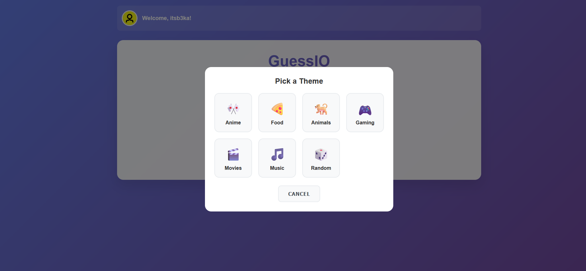
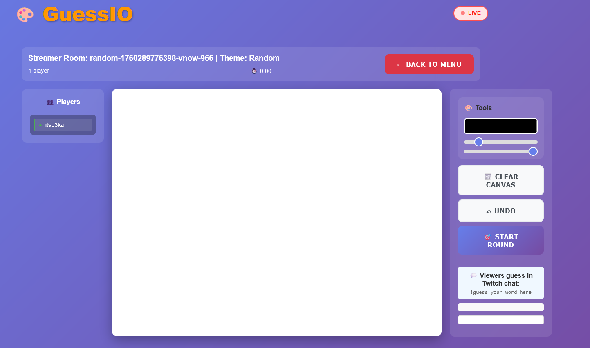
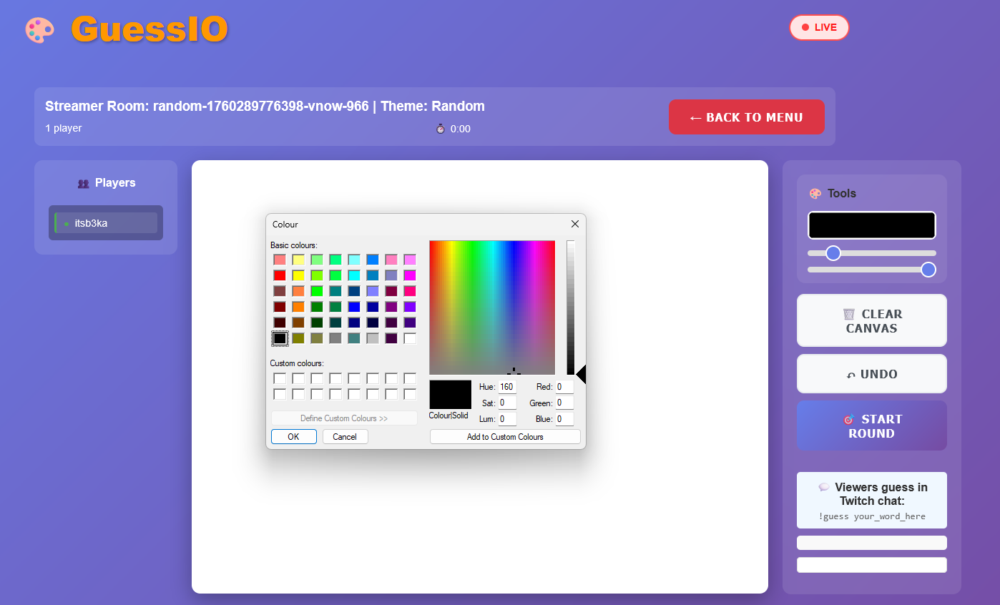

# GuessIO - Real-Time Collaborative Drawing Game

[](https://fastapi.tiangolo.com/)
[](https://nodejs.org/)
[](https://developer.mozilla.org/en-US/docs/Web/API/WebSockets_API)
[](https://www.twitch.tv/)
[](https://www.docker.com/)

> A real-time drawing and guessing game for Twitch streamers — viewers play in chat, the streamer draws on a shared canvas.

## Overview

GuessIO is a multiplayer drawing game built for live streams. The streamer hosts from a web lobby, picks a theme and round count, then draws while Twitch chat players join with `!join` and guess with `!guess <word>`. Game state syncs over WebSockets; auth and room data go through a FastAPI backend.

Designed and tested for **local development** with Docker Compose. Production deployment (HTTPS, WSS, env-based URLs) is not set up yet.

### What works today

- Twitch OAuth login and streamer lobby
- Theme selection and multi-round game sessions
- Gartic-style flow: word pick → countdown → draw
- Real-time canvas sync with stroke replay and undo
- Drawing persists across page refresh / reconnect
- Twitch bot: `!join`, `!guess`, mod `!skip` / `!endround`
- Session score display at round end (in-memory; not saved to DB yet)
- Stream layout with sidebar slots sized for OBS camera placement

### Not implemented yet

- Persisted scores and leaderboard UI (API exists, frontend missing)
- `VITE_WS_URL` — WebSocket URL is still hardcoded to `ws://localhost:9001`
- OBS overlay page, eraser tool, progressive hints
- Production HTTPS / WSS / secure cookies

See [`todo.txt`](todo.txt) for the full backlog.

<!-- ## Screenshots

### Homepage


### Theme selection


### Game room


### Drawing tools
 -->

## Technology stack

| Layer | Tech |
|-------|------|
| Game server | Node.js / TypeScript WebSocket server (`game-server/`) |
| API | FastAPI, SQLAlchemy, PostgreSQL, Alembic |
| Frontend | Vanilla JS modules, Vite dev server, HTML5 Canvas |
| Auth | Twitch OAuth 2.0 (session cookie) |
| Infra | Docker Compose |


> **Note:** Session helpers live in `api/session.js` (not `api/auth.js`) because ad blockers commonly block module URLs containing `/api/auth`.

## Quick start

### Prerequisites

- Docker & Docker Compose
- [Twitch Developer](https://dev.twitch.tv/console) app with OAuth redirect set to `http://localhost:8000/auth/callback`

### 1. Clone

```bash
git clone https://github.com/B00147423/GuessIO.git
cd GuessIO
```

### 2. Environment

Create a `.env` file in the project root:

```bash
# Database
POSTGRES_DB=guessio
POSTGRES_USER=postgres
POSTGRES_PASSWORD=password

# Twitch OAuth (required for login)
TWITCH_CLIENT_ID=your_twitch_client_id
TWITCH_CLIENT_SECRET=your_twitch_client_secret

# Twitch bot (optional — bot can spawn per streamer session)
TWITCH_OAUTH=oauth:your_bot_token
TWITCH_NICK=your_bot_username
TWITCH_CHANNEL=your_channel

# URLs — use 5173 when running via Docker Compose
FRONTEND_URL=http://localhost:5173
REDIRECT_URI=http://localhost:8000/auth/callback
ALLOWED_ORIGINS=http://localhost:5173,http://localhost:8000

# Optional frontend override (defaults to http://localhost:8000)
VITE_API_BASE_URL=http://localhost:8000
```

### 3. Run

```bash
docker compose up --build
```

### 4. Open

| Service | URL |
|---------|-----|
| Frontend | http://localhost:5173 |
| API docs | http://localhost:8000/docs |
| Game WebSocket | `ws://localhost:9001` |
| Health check | http://localhost:8000/health |

### Run without Docker (optional)

```bash
# Terminal 1 — Postgres (or use Docker for postgres only)
# Terminal 2 — backend
cd backend && uvicorn main:app --reload --port 8000

# Terminal 3 — game server
cd game-server && npm install && npm run dev

# Terminal 4 — frontend
cd frontend && npm install && npm run dev
```

## How to play

### Streamer (web)

1. Open http://localhost:5173 and log in with Twitch
2. Click **Start** → pick round count and theme
3. You land on the game page; the Twitch bot spawns for your channel
4. Choose a word, draw on the canvas, run multiple rounds

### Viewers (Twitch chat)

1. Type `!join` or `join` in chat (silent — you appear on the streamer UI)
2. When a round starts, guess with `!guess yourword`
3. Only joined players can guess; wrong guesses are not shown on the website feed

### Mod / broadcaster chat commands

- `!skip` — skip the current round
- `!endround` — end the current round early

## Architecture

```
┌─────────────┐     REST/OAuth      ┌─────────────┐
│  Frontend   │ ◄──────────────────►│   FastAPI   │
│  (Vite)     │                     │   Backend   │
└──────┬──────┘                     └──────┬──────┘
       │ WebSocket                         │ SQL
       ▼                                   ▼
┌─────────────┐     IRC            ┌─────────────┐
│ Game Server │ ◄──────────────────►│  PostgreSQL │
│ (port 9001) │   Twitch chat       └─────────────┘
└─────────────┘
```

- **Frontend** — two pages: `index.html` (landing/lobby) and `game.html` (in-room play)
- **Game server** — rooms, rounds, drawing sync, guess validation, Twitch bot
- **Backend** — OAuth, users, word themes, room metadata, scores API

## Development

### Load testing

```bash
cd tests
locust -f locustfile.py --host=http://localhost:8000
```

### Useful env vars

| Variable | Default | Purpose |
|----------|---------|---------|
| `VITE_API_BASE_URL` | `http://localhost:8000` | Backend URL for frontend fetches |
| `FRONTEND_URL` | — | OAuth redirect target after login |
| `REDIRECT_URI` | — | Twitch OAuth callback URL |
| `ALLOWED_ORIGINS` | — | CORS origins (comma-separated) |
| `GAME_SERVER_WS_URL` | `ws://game-server:9001` | Used by backend internally |

## Roadmap

- [ ] Env-based WebSocket URL (`VITE_WS_URL`)
- [ ] Persist round scores + leaderboard UI
- [ ] OBS browser-source overlay
- [ ] Eraser tool and progressive hints
- [ ] Production deploy (HTTPS, WSS, secure cookies)

## License

MIT — see [LICENSE](LICENSE).

## Author

**Beka Betsunaidze** — [GitHub](https://github.com/b00147423) · [LinkedIn](https://www.linkedin.com/in/beka-betsunaidze-76b612292)

---

<div align="center">

[Report Bug](https://github.com/B00147423/GuessIO/issues) · [Request Feature](https://github.com/B00147423/GuessIO/issues)

</div>
