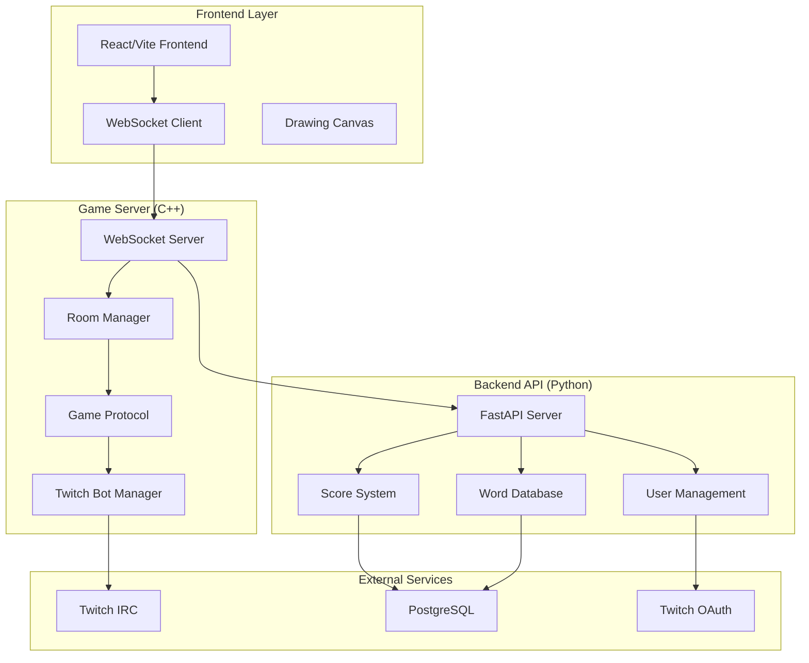

# GuessIO - Real-Time Collaborative Drawing Game

[](https://fastapi.tiangolo.com/)
[](https://isocpp.org/)
[](https://developer.mozilla.org/en-US/docs/Web/API/WebSockets_API)
[](https://www.twitch.tv/)
[](https://www.docker.com/)

> **A high-performance, real-time collaborative drawing game with Twitch integration, built with modern C++ and FastAPI**

## Overview

GuessIO is a sophisticated multiplayer drawing game that combines real-time WebSocket communication, Twitch chat integration, and collaborative gameplay. Players draw while others guess the word, creating an engaging social gaming experience perfect for streamers and their communities.

### Key Features

- **Real-Time Multiplayer**: WebSocket-based game with instant synchronization
- **Twitch Integration**: Streamers can host games directly in their chat
- **Collaborative Drawing**: Shared canvas with stroke replay and synchronization
- **Scoring System**: Persistent leaderboards and user statistics
- **OAuth Authentication**: Secure Twitch login integration
- **Docker Deployment**: Production-ready containerization
- **High Performance**: C++ game server for low-latency gameplay

## 🖼️ Screenshots

### Create Room


### Created Room


### Drawing


### Selecting Color


## Architecture



## 🛠️ Technology Stack

### **Backend Services**
- **Game Server**: C++ with Boost.Asio for high-performance WebSocket handling
- **API Server**: FastAPI (Python) with SQLAlchemy ORM
- **Database**: PostgreSQL with Alembic migrations
- **Authentication**: Twitch OAuth 2.0 integration

### **Frontend**
- **Framework**: Vanilla JavaScript with Vite build system
- **Real-time**: WebSocket client with automatic reconnection
- **Drawing**: HTML5 Canvas with stroke capture and replay
- **UI**: Modern CSS with responsive design

### **Infrastructure**
- **Containerization**: Docker & Docker Compose
- **WebSocket**: Custom protocol with JSON messaging
- **Twitch Integration**: IRC bot with command parsing
- **Deployment**: Production-ready with environment configuration

## Quick Start

### Prerequisites
- Docker & Docker Compose
- Twitch Developer Account (for OAuth)

### 1. Clone the Repository
```bash
git clone https://github.com/yourusername/GuessIO.git
cd GuessIO
```

### 2. Environment Setup
```bash
# Copy environment template
cp .env.example .env

# Edit .env with your Twitch credentials
TWITCH_CLIENT_ID=your_client_id
TWITCH_CLIENT_SECRET=your_client_secret
POSTGRES_PASSWORD=your_secure_password
```

### 3. Start the Application
```bash
# Development environment
docker-compose -f docker-compose.dev.yml up --build

# Production environment
docker-compose up --build
```

### 4. Access the Application
- **Frontend**: http://localhost:3000
- **API Documentation**: http://localhost:8000/docs
- **Game Server**: WebSocket on port 9001

##  How to Play

1. **Create/Join Room**: Start a new game or join an existing room
2. **Twitch Integration**: Streamers can use `!join` in chat to participate
3. **Drawing Phase**: One player draws while others guess the word
4. **Guessing**: Players submit guesses through the web interface or Twitch chat
5. **Scoring**: Points awarded for correct guesses and successful drawings
6. **Leaderboards**: Track progress across multiple games

## 🔧 Development

### Project Structure
```
GuessIO/
├── frontend/          # React/Vite frontend application
├── backend/           # FastAPI backend with database
├── cpp-server/        # High-performance C++ game server
├── tests/             # Load testing with Locust
└── docker-compose.yml # Container orchestration
```

### Key Components

#### **C++ Game Server** (`cpp-server/`)
- **WebSocket Server**: Handles real-time client connections
- **Room Management**: Multi-room support with isolated game states
- **Twitch Integration**: IRC bot for chat command processing
- **Game Protocol**: Custom message protocol for game events

#### **FastAPI Backend** (`backend/`)
- **User Management**: OAuth authentication and profile management
- **Score System**: Persistent scoring and leaderboards
- **Word Database**: Dynamic word selection and themes
- **Bot Control**: API endpoints for Twitch bot management

#### **Frontend** (`frontend/`)
- **Game Interface**: Real-time drawing and guessing interface
- **WebSocket Client**: Handles all real-time communication
- **State Management**: Game state synchronization and persistence

### Running Tests
```bash
# Load testing with Locust
cd tests
locust -f locustfile.py --host=http://localhost:8000
```

## Performance & Scalability

- **Concurrent Users**: Tested with 100+ simultaneous players
- **Latency**: Sub-50ms WebSocket message delivery
- **Throughput**: 1000+ requests/second API capacity
- **Memory**: Efficient C++ memory management with RAII
- **Database**: Optimized queries with proper indexing

##  Security Features

- **OAuth 2.0**: Secure Twitch authentication
- **Input Validation**: Comprehensive data sanitization
- **CORS Protection**: Configured cross-origin policies
- **Rate Limiting**: API endpoint protection
- **SQL Injection Prevention**: Parameterized queries

##  Deployment

### Production Deployment
```bash
# Build and deploy
docker-compose up -d

# Monitor logs
docker-compose logs -f

# Scale services
docker-compose up -d --scale backend=3
```

### Environment Variables
```bash
# Required for production
TWITCH_CLIENT_ID=your_production_client_id
TWITCH_CLIENT_SECRET=your_production_secret
POSTGRES_PASSWORD=secure_production_password
ALLOWED_ORIGINS=https://yourdomain.com
```

## Roadmap
- [ ] **Advanced Drawing Tools**: Brushes, colors, and effects
- [ ] **AI Integration**: Smart word suggestions and difficulty scaling
- [ ] **Analytics Dashboard**: Streamer insights and game statistics

##  Technical Achievements

- **Real-time Synchronization**: Custom WebSocket protocol for instant game state updates
- **Cross-Platform Integration**: Seamless Twitch chat and web interface interaction
- **High-Performance Architecture**: C++ game server with Python API backend
- **Scalable Design**: Docker containerization with horizontal scaling support
- **Modern Development**: CI/CD pipeline with automated testing

##  License

This project is licensed under the MIT License - see the [LICENSE](LICENSE) file for details.

##  Author

**Beka Betsunaidze* - [GitHub](https://github.com/b00147423) - [LinkedIn](www.linkedin.com/in/beka-betsunaidze-76b612292)

---

<div align="center">

** Star this repository if you found it helpful!**

[Report Bug](https://github.com/B00147423/GuessIO/issues) · [Request Feature](https://github.com/B00147423/GuessIO/issues) · 
[Documentation](https://github.com/B00147423/GuessIO/wiki)

</div>